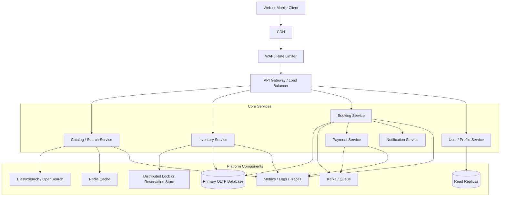
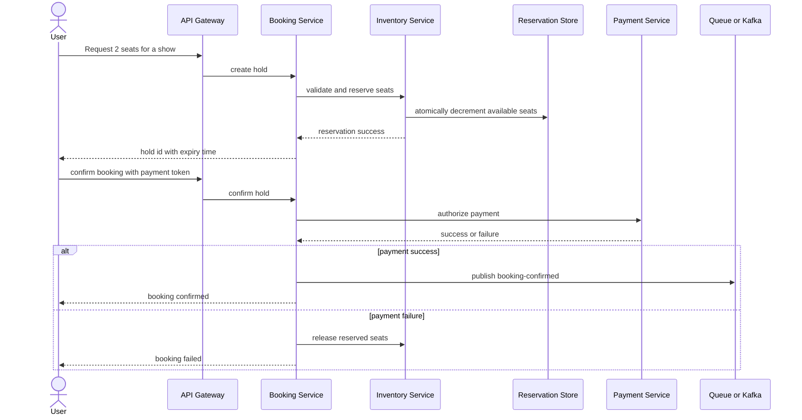

# Interview Preparation: Ticketmaster for a Senior Software Developer

## How To Position This Design

- Present the current codebase as a modular monolith that models four service boundaries: catalog, inventory, booking, and payment.
- Explain that this is the right starting point for clarity, fast iteration, and transactional simplicity.
- Then describe how each module can evolve into an independently deployable service when traffic, team size, or scaling hotspots justify the split.
- Emphasize that ticketing systems are dominated by contention, consistency, fairness, and operational visibility rather than just CRUD.

## What A Senior Interviewer Expects

- Clear distinction between current implementation and production-grade evolution path.
- Strong reasoning about concurrency on high-demand shows.
- Practical tradeoffs between consistency and availability.
- Failure-mode thinking: retries, duplicates, timeouts, compensation, and stale state.
- Operational depth: rate limiting, observability, alerting, and incident mitigation.

## Architecture Talking Points

- `CatalogService` owns discoverability: events, artists, cities, venues, and search filters.
- `InventoryService` owns seat availability and the most contention-sensitive logic.
- `BookingService` orchestrates holds, confirmation, cancellation, and expiry.
- `PaymentService` is isolated because payment latency and failures should not leak into inventory logic.
- The database is currently shared, but ownership boundaries are already visible in the package structure.

## High-Level Production Architecture

## Critical Booking Flow To Explain

## Senior-Level Interview Questions

1. How would you prevent overselling when thousands of users try to buy the same show at once?
   Talk about atomic reservation, pessimistic or optimistic locking, a reservation store, and short-lived holds.

2. Why is inventory the hardest service in a ticketing platform?
   Because it is the hotspot for correctness, fairness, and latency under burst traffic.

3. When would you keep this as a modular monolith instead of splitting it into microservices?
   Keep it together while a single database transaction gives real value and the team size does not require independent deployment.

4. If this becomes a real Ticketmaster-scale system, which module would you split first?
   Usually search and catalog first, then booking and payment integration, while treating inventory with extra care due to consistency needs.

5. How would you design seat holds?
   Use a hold record with expiry, idempotency keys, clear TTL semantics, and explicit release on timeout or failure.

6. How would you handle payment success arriving after the hold has expired?
   Use a saga or compensation flow: either reject and refund or extend hold semantics under strict business rules.

7. Would you use database locks, Redis, or a queue for seat reservation?
   The answer depends on contention level; explain the tradeoff between transactional simplicity, throughput, and operational complexity.

8. How would you make `confirm booking` idempotent?
   Require an idempotency key or deduplicate by booking id plus payment intent so retries do not create double charges.

9. How would you deal with traffic spikes when tickets open at 10:00 AM sharp?
   Use a virtual waiting room, admission control, per-user rate limits, caching, and graceful degradation for non-critical reads.

10. How would you guarantee fairness during high-demand sales?
    Discuss queueing, tokenized admission, per-user session constraints, and anti-bot controls.

11. What data would you cache, and what would you never cache aggressively?
    Cache catalog and search results heavily; be careful with seat availability because stale reads directly hurt trust.

12. How would you model a venue with assigned seating instead of just seat counts?
    Move from aggregate inventory to seat-level state, sections, price bands, and adjacency rules.

13. How would you support cancellation and seat release safely?
    Keep state transitions explicit and ensure only valid transitions release inventory once.

14. How would you observe this system in production?
    Emit metrics for reservation success rate, lock contention, payment latency, queue lag, hold expiry rate, and oversell prevention incidents.

15. What alerts would you configure first?
    Spike in payment failures, inventory mismatch, elevated confirm latency, backlog growth, and unusual burst traffic patterns.

16. How would you scale reads for search and show discovery?
    Use a search index, cache hot events, and route read-heavy traffic away from the transactional booking path.

17. How would you shard data if one region becomes too hot?
    Start with geo or venue-based partitioning, but explain that the hottest entities may still require special handling.

18. How do you avoid double-release of seats?
    State machine validation, idempotent handlers, and one-way transition checks are key.

19. Would you use synchronous or asynchronous communication between booking and notification?
    Notifications should be asynchronous because they are non-critical to the booking commit path.

20. How would you explain CAP tradeoffs here?
    Inventory and booking lean toward consistency for correctness, while discovery and analytics can tolerate eventual consistency.

21. What would you do if the payment provider is slow but not fully down?
    Use timeouts, circuit breakers, retries with limits, and let holds expire safely instead of blocking inventory indefinitely.

22. How would you test concurrency risks?
    Use integration tests, contention simulations, load tests, and state-reconciliation checks against oversell scenarios.

23. How would you evolve from H2 to production data stores?
    Move to PostgreSQL or MySQL for OLTP, Redis for short-lived reservations, and a search index for discovery.

24. How would you support multi-region booking?
    Keep inventory ownership clear, reduce cross-region write conflicts, and choose whether inventory is region-primary or globally coordinated.

25. How would you respond to an incident where users were charged but did not receive tickets?
    Reconcile payment events against booking state, use compensating workflows, replay safe messages, and provide an operational dashboard for manual recovery.

## Deep-Dive Topics A 10-Year Candidate Should Be Comfortable With

- Pessimistic lock versus optimistic lock for hot rows
- Reservation TTL and expiry sweeper design
- Queue-based outbox pattern for reliable side effects
- Idempotency keys for public APIs
- Read model versus write model separation
- Anti-bot and abuse mitigation
- Replay-safe event processing
- Capacity planning for drop traffic
- Backpressure and admission control
- Incident response and data reconciliation

## Good Follow-Up Answers

- Why modular monolith first: fewer moving parts and easier consistency.
- Why not cache seat counts too aggressively: stale availability creates bad user trust and operational pain.
- Why payment is separate: it is an unreliable external dependency that should not own inventory.
- Why search should eventually split: read-heavy behavior and indexing needs are very different from booking writes.
- Why queueing matters: side effects like notification, analytics, and audit should not slow the booking transaction.

## Practical System Design Upgrades To Mention

- Add Redis for reservation TTL and fast counters.
- Add a waiting-room service for major launches.
- Add an outbox table for reliable event publication.
- Add a search index for artist, venue, and city queries.
- Add seat maps, sections, and dynamic pricing support.
- Add audit history for every booking state change.
- Add admin tools for manual release and reconciliation.

## Short Revision Notes

- Hotspot: inventory, not catalog.
- Main risk: oversell under burst concurrency.
- Core pattern: hold first, pay second, confirm third.
- Reliability pattern: idempotency plus compensation.
- Scaling pattern: split read-heavy search before consistency-critical inventory.
