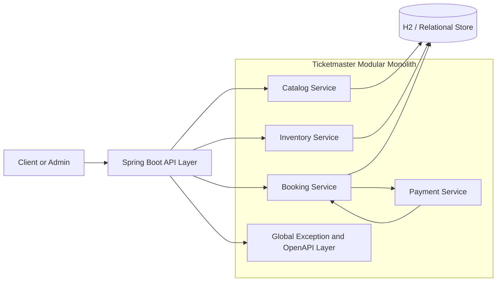
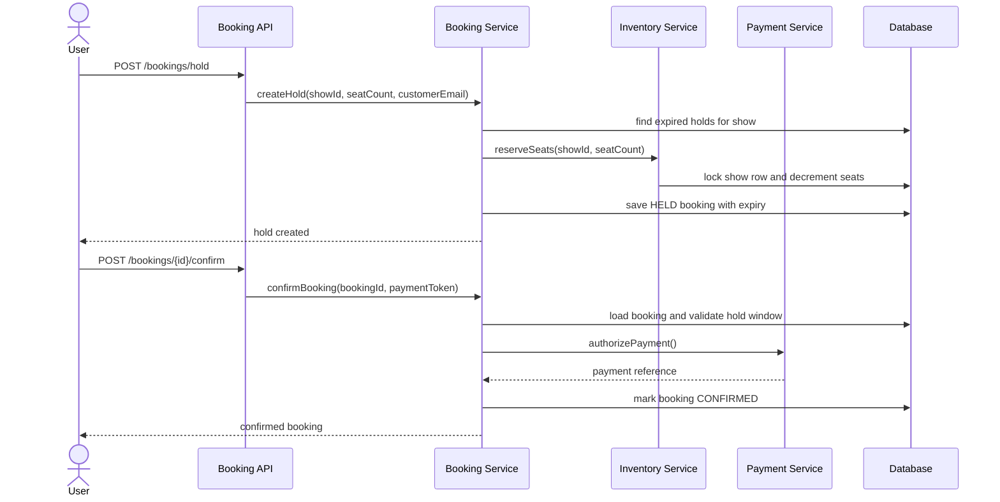

# Ticketmaster

Spring Boot 4 sample application that models a simplified ticket-booking system with clear service boundaries for catalog, inventory, booking, and payment.

## What This Project Shows

- `CatalogService` for event creation and discovery
- `InventoryService` for show creation and seat reservation
- `BookingService` for ticket holds, confirmation, and cancellation
- `PaymentService` for payment authorization simulation
- H2-backed persistence with pessimistic locking on seat inventory
- OpenAPI and Swagger UI for exploring the flow end to end

## Tech Stack

- Java 21
- Spring Boot 4.0.5
- Spring Data JPA
- H2
- Spring Validation
- springdoc-openapi

## Domain Model

- `Event`: artist, venue, category, and city metadata
- `Show`: dated performance with price, capacity, and available seats
- `Booking`: customer hold or confirmed reservation against a show

## Service Boundaries

- `catalog`: event onboarding and search
- `inventory`: show management plus seat locking and release
- `booking`: orchestration around holds, checkout, expiry, and cancellation
- `payment`: isolated payment authorization simulation

This runs as a modular monolith, but the packages are separated so they can be discussed as independent services in a system design interview.

## Architecture Diagram



## Booking Flow Diagram



## API Documentation

After starting the application:

- Swagger UI: `http://localhost:8080/swagger-ui.html`
- OpenAPI JSON: `http://localhost:8080/v3/api-docs`
- Catalog group: `http://localhost:8080/v3/api-docs/catalog`
- Inventory group: `http://localhost:8080/v3/api-docs/inventory`
- Bookings group: `http://localhost:8080/v3/api-docs/bookings`

## Main Endpoints

- `POST /events`
- `GET /events?city=Bengaluru&q=Coldplay`
- `POST /events/{eventId}/shows`
- `GET /shows?city=Bengaluru&q=Coldplay`
- `GET /shows/{showId}`
- `POST /bookings/hold`
- `POST /bookings/{bookingId}/confirm`
- `POST /bookings/{bookingId}/cancel`
- `GET /bookings/{bookingId}`

## Example Flow

1. Create an event with `POST /events`.
2. Create a show for that event with `POST /events/{eventId}/shows`.
3. Hold seats with `POST /bookings/hold`.
4. Confirm the booking with `POST /bookings/{bookingId}/confirm`.
5. Fetch the booking or show to inspect the final state.

## Local Run

```bash
./mvnw spring-boot:run
```

The application uses an in-memory H2 database, so no external setup is required.

## Interview Preparation

See `INTERVIEW_PREPARATION.md` for senior-level interview questions, scalability tradeoffs, and discussion points for explaining this design in an interview.
