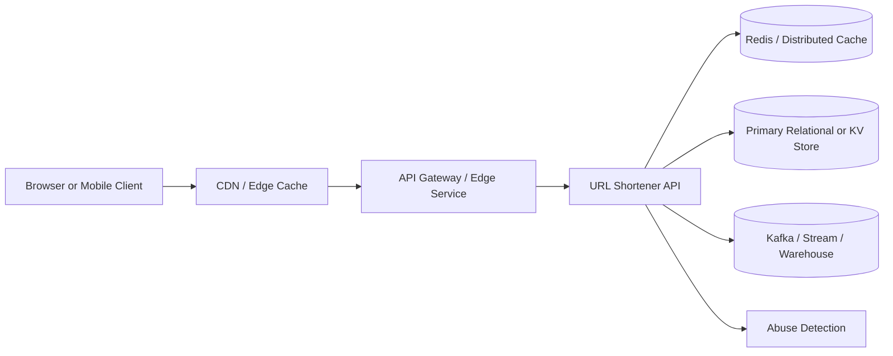

# URL Shortener Interview Preparation

This document is meant for senior, staff, principal, and specialist-level system design interviews. It takes the current workspace and expands it into the kind of production architecture and tradeoff discussion expected in higher-level rounds.

## 1. Problem Statement

Design a URL shortener that:

- Accepts long URLs and returns short aliases
- Redirects users from a short code to the original URL with very low latency
- Supports custom aliases, expiration, disablement, and analytics counters
- Survives hot keys, traffic spikes, and regional failures
- Evolves from a simple service into a globally distributed platform

## 2. Functional Requirements

- Create a short URL from a long URL
- Support optional custom aliases
- Redirect by short code
- Disable a short URL
- Support expiration timestamps
- Expose basic metadata such as creation time, last accessed time, redirect count, and status

## 3. Non-Functional Requirements

- Very high read-to-write ratio
- P99 redirect latency should be low, typically under 50 ms at the edge and under 100 ms end to end
- High availability is more important than perfect analytics freshness
- Redirect path must degrade gracefully under dependency failures
- Idempotent or conflict-safe create semantics
- Abuse protection for malicious URLs, bot traffic, and alias squatting

## 4. API Surface

Core APIs:

- `POST /api/v1/urls`
- `GET /api/v1/urls/{shortCode}`
- `GET /r/{shortCode}` or `GET /{shortCode}`
- `DELETE /api/v1/urls/{shortCode}` or `POST /api/v1/urls/{shortCode}/disable`

Typical request:

```json
{
  "originalUrl": "https://example.com/docs/platform/2026/launch-plan",
  "customAlias": "launch26",
  "expiresAt": "2026-12-31T23:59:59Z"
}
```

## 5. High-Level Architecture



### Component Responsibilities

- `CDN / edge`: absorbs hot redirect traffic and optionally caches permanent redirect responses
- `gateway`: auth, rate limiting, WAF rules, request shaping, and routing
- `app service`: create, lookup, validation, lifecycle management, and redirect resolution
- `cache`: hot code lookup and metadata acceleration
- `database`: source of truth for short code mappings
- `analytics pipeline`: asynchronous clickstream, geo/device enrichment, and BI
- `abuse detection`: malware scans, domain allowlists/blocklists, and bot heuristics

## 6. Current Workspace Mapping

The repository already models a solid intermediate architecture:

- `backend/`: core short URL creation, metadata fetch, redirect resolution, cache invalidation, and persistence
- `application-gateway/`: edge gateway and security controls
- `frontend/`: operator dashboard and helper flows

That makes this workspace a good starting point for discussing the evolution path from a single-region service to a production internet platform.

## 7. Data Model

Recommended mapping record:

```text
short_code
original_url
status
created_at
updated_at
expires_at
last_accessed_at
redirect_count
owner_tenant_id
custom_alias_flag
```

Optional analytics event:

```text
event_id
short_code
timestamp
country
device_type
referrer
user_agent_hash
```

## 8. Read Path

Redirect is the hot path:

1. Client requests `/{shortCode}`
2. Edge or CDN checks cache
3. If miss, gateway forwards to redirect service
4. Service checks Redis or local cache
5. If cache miss, service reads source of truth
6. Service validates status and expiration
7. Service returns `301` or `302` with target URL
8. Redirect analytics is emitted asynchronously

Why asynchronous analytics matters:

- redirect latency should not wait on counters or warehouse writes
- losing a small number of click events is often acceptable
- mappings are critical path data; analytics is usually not

## 9. Write Path

Create is usually much lower QPS than redirect:

1. Validate URL format and expiration
2. Run safety checks and policy checks
3. Resolve alias:
   - custom alias if user supplied one
   - generated code otherwise
4. Persist mapping with uniqueness constraint
5. Warm cache for the created short code
6. Return shortened URL

## 10. Short Code Generation Strategies

### Option A: Random Base62

Pros:

- easy to implement
- hard to enumerate if code length is large enough
- distributes well in storage systems

Cons:

- collision checks needed
- poor temporal ordering

### Option B: Counter + Base62 Encoding

Pros:

- no collisions if ID generation is correct
- operationally simple

Cons:

- easy to enumerate
- leaks volume and sequencing
- global monotonic counters can bottleneck

### Option C: Snowflake-style ID + Encoding

Pros:

- scalable distributed ID generation
- avoids a central counter
- sortable if needed

Cons:

- more operational complexity
- still partially predictable

For senior-level discussion, random Base62 plus uniqueness checks is often enough. For specialist-level discussion, talk about namespace partitioning, anti-enumeration salts, and regional code allocators.

## 11. Storage Choices

### Relational Database

Good when:

- write volume is moderate
- strong uniqueness constraints matter
- admin and lifecycle queries are important

Pros:

- easy uniqueness on `short_code`
- straightforward schema evolution
- good fit for metadata-oriented management APIs

Cons:

- hot redirect traffic should not directly hit the DB
- global multi-region writes get harder

### Distributed KV Store

Good when:

- redirect scale is extreme
- lookup-by-key dominates everything
- eventual consistency is acceptable for some metadata

Pros:

- high read throughput
- horizontal scale

Cons:

- harder secondary querying
- lifecycle workflows may need extra indexing systems

## 12. Caching Strategy

Use layered caching:

- browser and CDN for redirect responses where policy allows
- Redis for hot short-code metadata
- optional in-process cache for microbursts

Key design points:

- cache by `shortCode`
- TTL should be shorter than operational tolerance for stale state
- disable and expire operations must invalidate or update cache quickly
- protect against cache stampede using request coalescing or soft TTL

## 13. Capacity Planning Example

Assume:

- 100 million new URLs per month
- 5 billion redirects per month
- average redirect lookup payload around 300 bytes before overhead

Roughly:

- writes per second: around 40 QPS sustained, much higher at peak
- reads per second: around 2,000 QPS sustained, much higher at peak
- at internet scale, plan for 10x to 50x burst over average

Interview move:

- always distinguish average from peak
- explain that redirect traffic is highly bursty and influenced by social media virality
- design around hot keys, not just average QPS

## 14. Scaling Evolution

### Stage 1: Single Region

- one API service
- one relational DB
- one Redis cluster
- acceptable for small products and internal tools

### Stage 2: Production Regional Service

- multiple stateless app instances
- DB primary with replicas
- Redis cluster
- gateway with rate limiting
- async analytics pipeline

### Stage 3: Multi-Region Active/Active Redirect

- geo-routing to nearest region
- globally replicated cache or region-local caches
- region-local redirect serving
- create requests routed to a write-home region or to a globally coordinated ID/mapping layer

### Stage 4: Internet-Scale Platform

- edge redirect execution for hottest keys
- globally distributed metadata store
- streaming analytics and anti-abuse platform
- per-tenant quotas and isolated rate limits
- automated data lifecycle and archival

## 15. Consistency Discussion

Strong consistency is most important for:

- custom alias uniqueness
- disable semantics for safety or compliance

Eventual consistency is usually acceptable for:

- redirect counters
- dashboards
- geo/device analytics
- read replica lag for admin views

A strong answer separates control-plane consistency from data-plane latency.

## 16. Failure Modes

### Cache Failure

- fall back to DB for lookups
- add circuit breakers and admission control
- shed analytics first, not redirect correctness

### Database Failure

- redirect path may serve stale cache temporarily
- create path may need fail-closed behavior
- cross-region failover requires alias uniqueness strategy

### Hot Key Explosion

- CDN cache
- request collapsing
- short-lived local cache
- replication of hottest mappings into edge stores

### Abuse Incident

- instant disable or tombstone propagation
- cache purge path
- blocklist propagation to edge and app

## 17. Security and Abuse Controls

- URL validation and normalization
- phishing and malware scanning
- per-user or per-tenant rate limits
- reserved alias namespaces
- audit logs for disable/delete actions
- signed admin APIs and least-privilege access
- correlation IDs and immutable audit events

## 18. Observability

Track:

- redirect QPS
- create QPS
- cache hit ratio
- DB lookup latency
- P50, P95, P99 redirect latency
- hot-key concentration
- error rate by cause
- abuse detection hit rate

Ask for dashboards that separate:

- control plane: create, disable, admin APIs
- data plane: redirect traffic

## 19. Tradeoffs to Call Out in an Interview

- random IDs versus sequential IDs
- relational versus KV storage
- strict uniqueness versus global write availability
- inline analytics versus async analytics
- long cache TTL versus fast safety updates
- 301 versus 302 for cacheability and changeability

## 20. Senior-Level Interview Questions

1. How would you design the core create and redirect APIs for a URL shortener?
2. What storage system would you choose first and why?
3. How would you generate short codes while avoiding collisions?
4. How would you cache redirect lookups safely?
5. What data should be stored synchronously versus asynchronously?
6. How would you support custom aliases without race conditions?
7. How would you handle expiration and disabled links?
8. What metrics would you track from day one?

What strong senior answers usually include:

- clear read/write separation
- uniqueness constraints
- cache invalidation awareness
- latency-sensitive redirect path
- basic abuse and observability considerations

## 21. Staff-Level Interview Questions

1. A celebrity posts one short link and traffic jumps 1,000x in two minutes. What breaks first and how do you protect the system?
2. How would you evolve from one region to multiple regions?
3. Which components need strong consistency and which can be eventually consistent?
4. How would you redesign the analytics path so it does not impact redirect latency?
5. How would you partition data as the dataset grows into billions of mappings?
6. How would you decide between relational storage and a distributed KV store?
7. What operational runbooks would you create for cache failure, DB failure, and abuse incidents?

What strong staff answers usually include:

- staged evolution plan
- control plane vs data plane separation
- failure-mode thinking
- hot partition and hot key mitigation
- operational tradeoffs, not just component lists

## 22. Principal / Specialist-Level Interview Questions

1. How would you design a globally distributed URL shortener that offers low-latency redirects in North America, Europe, and India while preserving alias uniqueness?
2. How do you prevent global write coordination from becoming the system bottleneck?
3. Would you allow region-local short code generation, and how would you prevent collisions or semantic leakage?
4. How would you support instant takedown of malicious links across CDN, caches, and regional stores?
5. How would you separate tenant, compliance, and geographic data residency concerns in the platform?
6. When does edge execution become worth the operational cost?
7. How would you reason about availability targets when redirect correctness and safety updates conflict?
8. How would you design for observability when most traffic is served at the edge instead of in the origin service?

What strong specialist answers usually include:

- explicit consistency boundaries
- regional topology discussion
- CAP tradeoff awareness in plain language
- edge invalidation strategy
- abuse, compliance, and platform governance
- pragmatic sequencing instead of overengineering from day one

## 23. Follow-Up Prompts Interviewers Often Use

- Why not just keep everything in Redis?
- Why not store the full redirect response at the CDN forever?
- What happens if two users request the same custom alias at the same millisecond?
- How would you migrate code generation strategy without breaking existing links?
- How would you backfill analytics if the pipeline is down for two hours?
- What if a customer wants vanity domains per tenant?
- What if legal asks for hard delete instead of soft disable?

## 24. A Good Specialist-Level Narrative

If time is short, a strong concise answer often sounds like this:

1. Start with a single-region service using relational storage for authoritative mappings and Redis for hot lookups.
2. Keep redirect resolution extremely lean and make analytics asynchronous.
3. Enforce alias uniqueness strongly in the control plane.
4. Add CDN and edge caching to handle hot keys before introducing global complexity.
5. Split control plane and data plane as scale grows.
6. Move toward multi-region redirect serving with careful treatment of write coordination, safety invalidation, and compliance.

## 25. What Interviewers Want to Hear at Higher Levels

- You know where complexity belongs and where it does not.
- You can justify why a simpler design is the right first step.
- You think in failure domains, not just boxes and arrows.
- You know which guarantees matter to users, operators, finance, legal, and security.
- You can explain tradeoffs clearly without hiding behind buzzwords.
