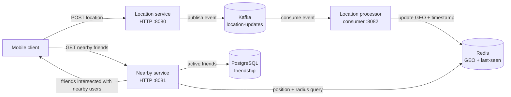

# Architecture

## Overview

The system separates location ingestion, asynchronous location indexing, and nearby-friend queries. PostgreSQL is the source of friendship status; Redis GEO is the location search index.

## Location Ingestion Flow

1. A client posts a user's coordinates, accuracy, and event timestamp to `POST /api/v1/locations` on port `8080`.
2. The location service validates the request, publishes a `LocationUpdatedEvent` to the Kafka topic `location-updates`, and responds with `202 Accepted`.
3. The location processor consumes the event and updates the user's Redis GEO position. Older events are ignored to prevent stale location data from replacing newer data.
4. The processor tracks last-seen timestamps and removes locations that have not been refreshed for two minutes. Expiration is checked every 30 seconds.

Because the write path is asynchronous, an accepted location update may not be visible to nearby queries immediately.

## Nearby Query Flow

1. A client calls `GET /api/v1/nearby-friends` on port `8081`, supplying `userId` and optionally `radiusKm` (default `5`).
2. The service reads the requester's current position from Redis GEO. If no position exists, it returns an empty array.
3. Redis returns users within the requested radius, sorted by ascending distance.
4. The service loads the requester's `ACTIVE` friend IDs from PostgreSQL.
5. It returns only the intersection of nearby users and those friend IDs. Each result has `userId` and `distanceKm`.

Friendship is directional in storage: a result is considered a friend only when an active row exists with the requester in `user_id` and the candidate in `friend_id`.

## Dependencies and Local Ports

| Dependency | Local address | Purpose |
| --- | --- | --- |
| PostgreSQL | `localhost:5432` | Friendship records; schema migrated by Flyway. |
| Redis | `localhost:6379` | Current user coordinates and last-seen scores. |
| Kafka | `localhost:29092` | Local client listener for location events. |
| Kafka UI | `http://localhost:8085` | Local topic inspection. |

The Kafka topic is configured as `location-updates`. The compose file runs a single local broker; service configuration sets the location producer's partition count to `3`.

## Operational Notes

- Redis and PostgreSQL are separate stores with different responsibilities; friendship filtering is not performed in Redis.
- Location event processing and nearby queries are eventually consistent.
- Location expiration is based on processor-maintained last-seen scores, with a two-minute freshness window.
- The nearby API currently exposes only a read operation. Friendship management and location writes are handled outside that service.
