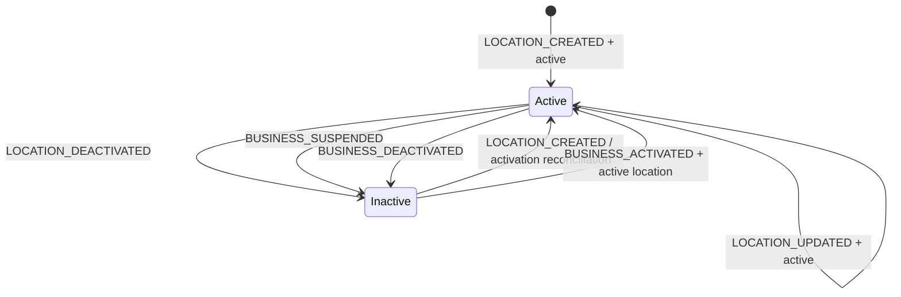
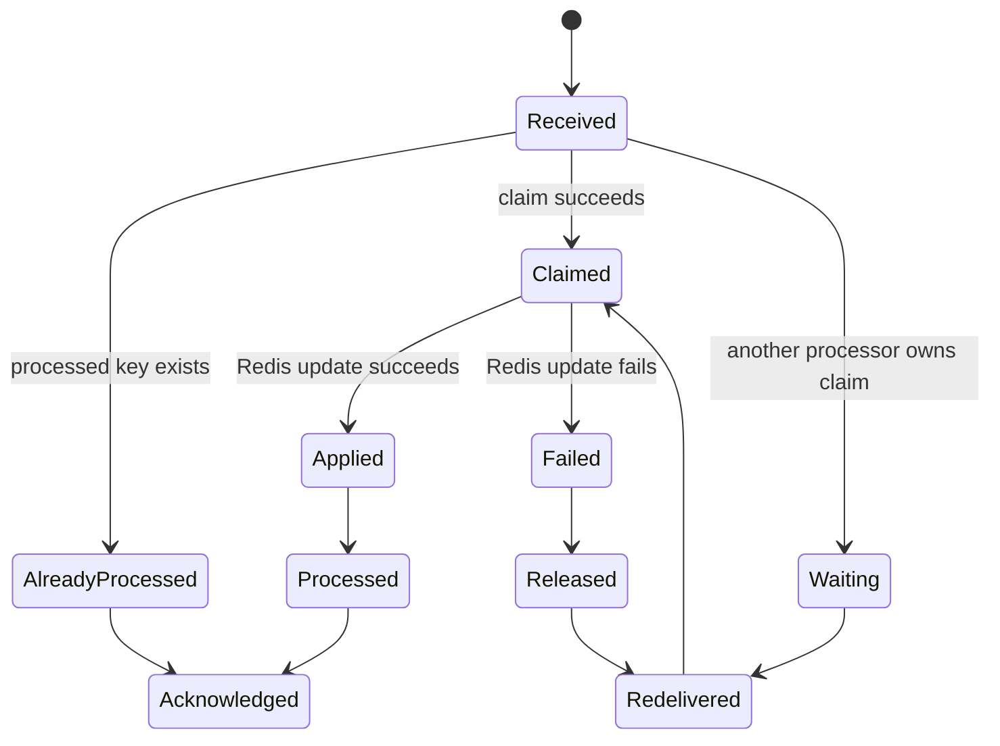
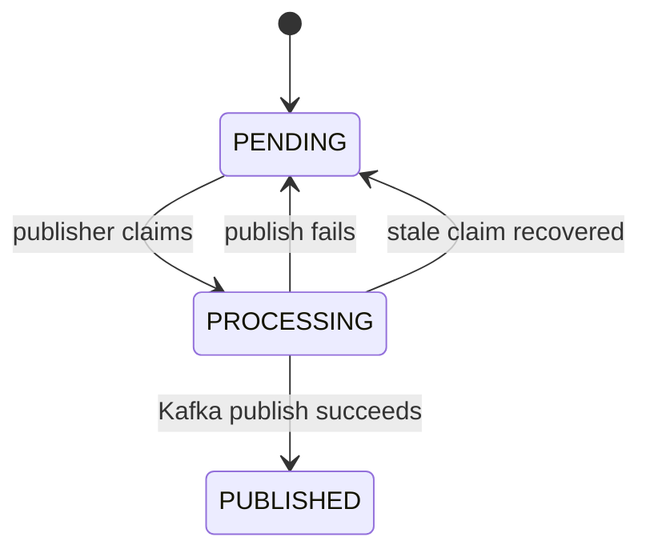
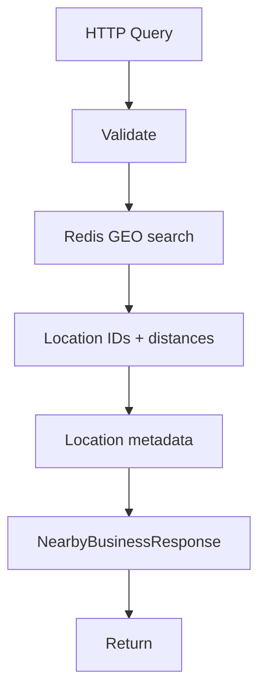

# Proximity Service — State Diagrams

## Location lifecycle

```mermaid
stateDiagram-v2
    [*] --> Active: LOCATION_CREATED + active
    Active --> Active: LOCATION_UPDATED + active
    Active --> Inactive: LOCATION_DEACTIVATED
    Active --> Inactive: BUSINESS_SUSPENDED
    Active --> Inactive: BUSINESS_DEACTIVATED
    Inactive --> Active: LOCATION_CREATED / activation reconciliation
    Inactive --> Active: BUSINESS_ACTIVATED + active location
```

## Kafka event processing

```mermaid
stateDiagram-v2
    [*] --> Received
    Received --> AlreadyProcessed: processed key exists
    AlreadyProcessed --> Acknowledged
    Received --> Claimed: claim succeeds
    Received --> Waiting: another processor owns claim
    Claimed --> Applied: Redis update succeeds
    Claimed --> Failed: Redis update fails
    Applied --> Processed
    Processed --> Acknowledged
    Failed --> Released
    Released --> Redelivered
    Waiting --> Redelivered
    Redelivered --> Claimed
```

## Outbox

```mermaid
stateDiagram-v2
    [*] --> PENDING
    PENDING --> PROCESSING: publisher claims
    PROCESSING --> PUBLISHED: Kafka publish succeeds
    PROCESSING --> PENDING: publish fails
    PROCESSING --> PENDING: stale claim recovered
```

## Query flow

```mermaid
flowchart TD
    A[HTTP Query] --> B[Validate]
    B --> C[Redis GEO search]
    C --> D[Location IDs + distances]
    D --> E[Location metadata]
    E --> F[NearbyBusinessResponse]
    F --> G[Return]
```
